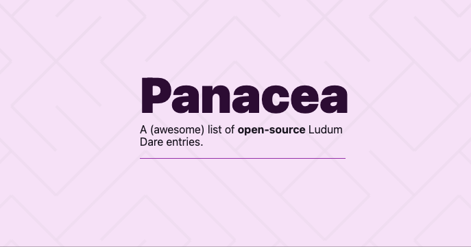

# The Panacea project

The Panacea project is a small project to support game developers in their learning journey.

This repository have two main components:

- A website (`web/`) hosted on https://inacio.dev/panacea
    - The web uses React, Next.JS and it's hosted on Vercel.
    - Some known limitations are: 
        - Not all games have a category. There is an item in my roadmap to fix this
        - Not all games from Ludum Dare are listed and this is also being fixed very soon
- A Go program (`scraper/`), that indexes Ludum Dare games and categorizes them using different APIs

The website has an exhaustive list of Ludum Dare Compo entries, with their open-source links, overall Ludum Dare grade and, whenever available, which engine/language it was built with. Filters are your friend and all columns can be sorted.

## Roadmap

- Responsive CSS: right now the layout basically sucks.
- Support for more providers besides Github
- Support games outside of Compo category
- Dark theme 🌚

## Contributing

- Any contribution is welcomed :)
- If you have any questions reach out via Issues or to me directly, via Twitter: https://twitter.com/inacho_

## Credits

- All due credit to the amazing work done by the Ludum Dare core team at https://github.com/JammerCore/JammerCore
